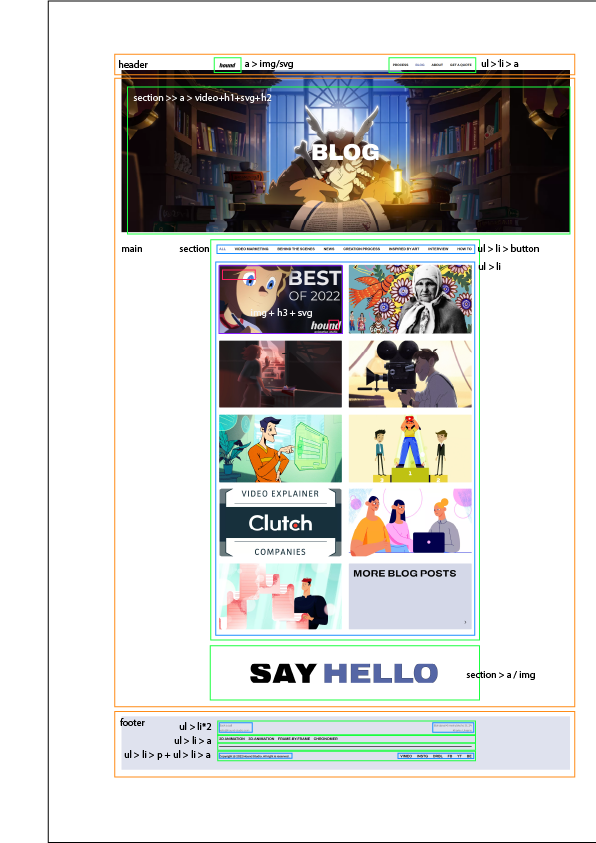
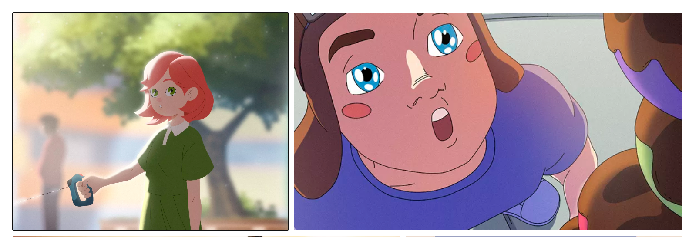
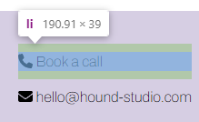
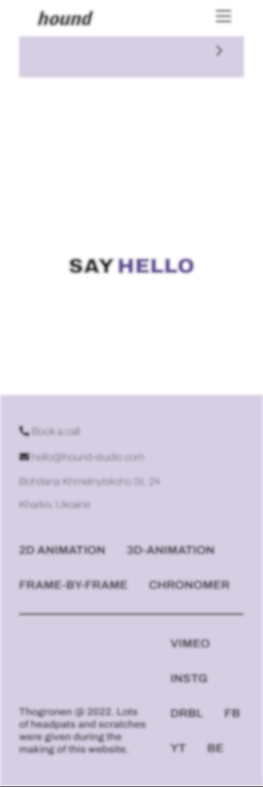
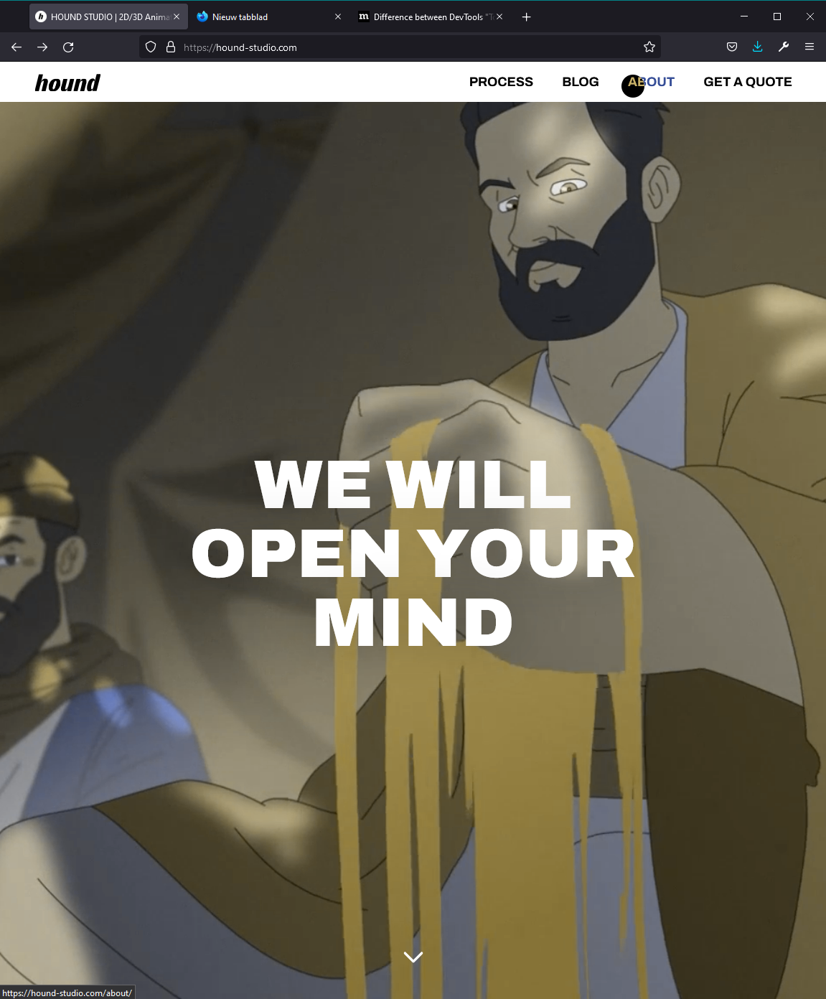
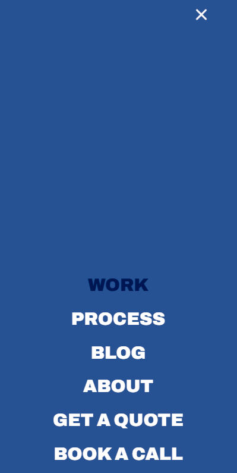
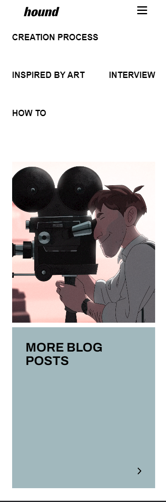
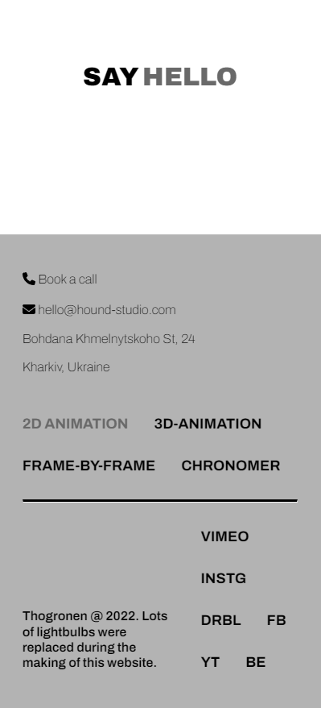
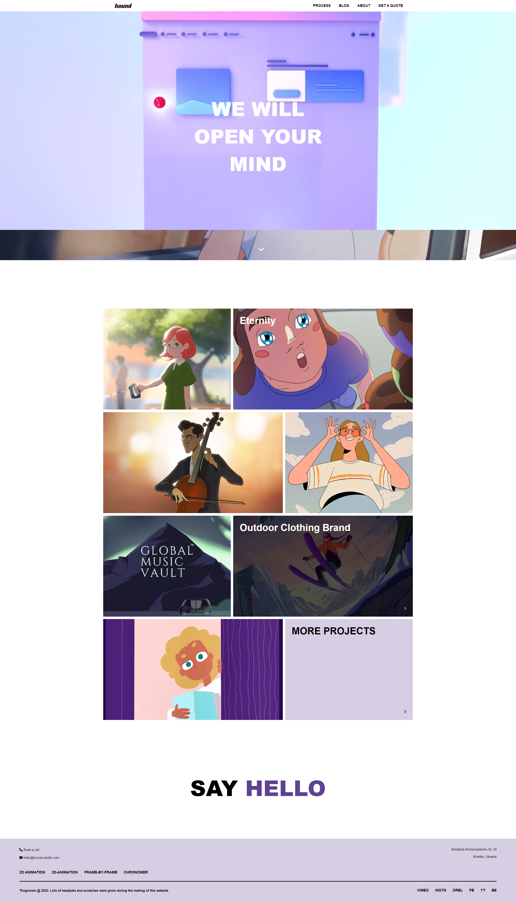
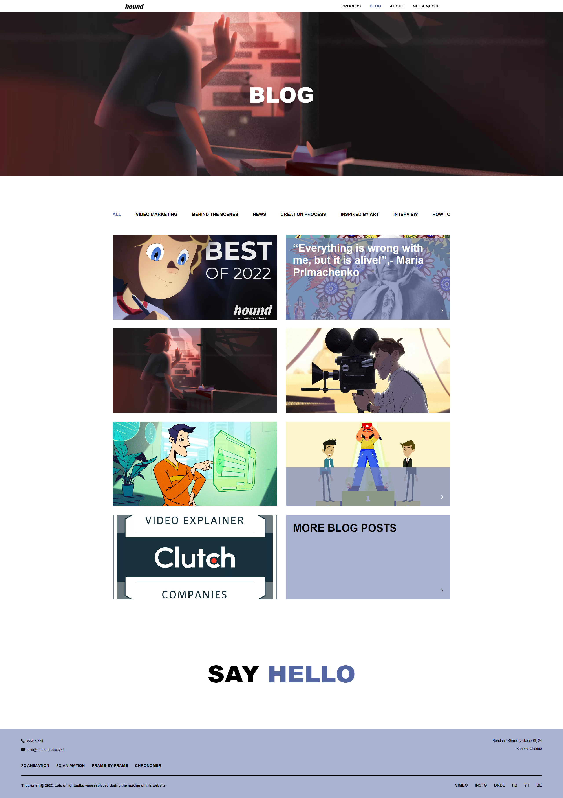

# Procesverslag

## Jij

<details  open>

### Auteur

Thomas Groeneweg

#### Je startniveau

<span  style="color:blue">Blauw</span>

#### Je focus

Responsive

</details>

## Je website

<details  open>

### Je opdracht

[Hound Studio](https://hound-studio.com/)

#### Screenshot(s) van de eerste pagina (small screen)

Hoofdpagina


#### Screenshot(s) van de tweede pagina (small screen)

Josh Story


#### Menu (small screen)

Menu


</details>

## Toegankelijkheidstest 1/2 (week 1)

<details>

<summary>uitwerken na test in 1e werkgroep</summary>

### Bevindingen

Lijst met je bevindingen die in de test naar voren kwamen:

1. <b>Headers</b> bestaan praktisch niet; veel headers zijn p elementen.

2. <b>Alt text</b> heeft op het moment niet veel nut - het geeft je de naam van de afbeelding, meer niet.

#### Screenreader

Hier korte omschrijving (met indien nodig afbeeldingen)

Headers worden wel/niet gezien door de screenreader - op een of andere manier worden ze wel erkend als headers, maar in de code zijn het p's en dus onmogelijk om makkelijk naar toe te navigeren met alleen een keyboard.

Links zijn soms super onduidelijk - wat IS Josh' droom? Waar gaan we heen?


1. Vervang de P waar nodig met headers.

2. Gebruik alt text die ook iets betekent voor de mensen die de screenreader nodig hebben.

3. Zorg dat de alt text anders is dan tekst die al eerder opgelezen is.

#### Muis en Toetsenbord

Er zijn niet super veel elementen met hover/focus/active componenten, het enige wat er uit springt is de consistente dot die je muis volgt en de elementen er onder van kleur laat veranderen. Active komt volgens mij nergens voor, hover is te vinden op (praktisch)alle interactieve elementen. Focus doet ook niks (behalve het simpelweg omranden van elementen).

Er hoeft in principe niks opgelost te worden, maar er is altijd de mogelijkheid om zelf dingen toe te voegen.

#### Visueel (brillen, contrast, kleurenblind, dark/light)

Contrast is meestal wel OK - WebAIM en de ingebouwde tools doen moeilijk omdat de achtergrondkleur niet genoeg contract heeft tov de letters. Enkel als er geen blauw aanwezig is verandert het palet aanzienlijk, maar het is nog steeds goed leesbaar dankzij het dikke font. De meeste kleuren (waar van belang) zitten in de afbeeldingen. *Mocht* het zo uitkomen dat het contrast daar te laag is is het een mogelijkheid om de achtergrond bijvoorbeeld iets donkerder te maken.

Hier een omschrijving van hoe het opgelost kan worden (met indien nodig afbeeldingen)

Standaard View


Geen Blauw


Geen Rood


Geen Groen


Greyscale


Minder Contrast


</details>

## Breakdownschets (week 1)

<details>

<summary>uitwerken na afloop 2e werkgroep</summary>

### Hoofdpagine


### Blog



### dynamisch deel (bijv menu)


</details>

## Voortgang 1 (week 2)

<details>

<summary>uitwerken voor 1e voortgang</summary>

### Stand van zaken

hier dit ging goed & dit was lastig (neem ook screenshots op van delen van je website en code)

### Agenda voor meeting

samen met je groepje opstellen

### Verslag van meeting

hier na afloop snel de uitkomsten van de meeting vastleggen

- punt 1

- punt 2

- nog een punt

- ...

</details>

## Voortgang 2 (week 3)

<details>

<summary>uitwerken voor 2e voortgang</summary>

### Stand van zaken

Goed:

- Het maken van de grids/flexbox

- Begonnen met een beetje media queries (mag @container?)

Lastig:

- Het linken van scripts (silly me)

- Bepalen welke elementen zou wel/niet gestijld moeten worden soms

- Zorgen dat alles niet alleen werkt in VS maar ook live :(

Nog te doen:

- Checken voor Accessibility

### de hele pagina


### Agenda voor meeting

samen met je groepje opstellen

| **Niga** | **Kim** | **Alexander** | **Thomas** | **Ralph** |
| --- | --- | --- | --- | --- |
| HTML Structuur | HTML Structuur | HTML Structuur | HTML Structuur | HTML Structuur |
| Menu how-to | Menu how-to | Image Slidehow | Paginakeuze | Menu how-to |
| | | | Link/A sizing (grid?) | |
| | | | Accessibility | |

### Verslag van meeting

- Er is (deels) gekeken naar de DOM structuur van iedereen. Lijstjes en ordering waren meestal het grootste ding, en de meesten van ons moeten nog wel redelijk wat aanpassen daar aan.

- Het verschil tussen buttons (doet iets) en links (stuurt je ergens heen)

- Turbo cursus flex-order.

- .visually-hidden en ARIA-labels.

- Beetje gekeken naar transitions en positioning.

- Div gebruik (eigenlijk alleen bij het groeperen van elementen)

- Span liever alleen voor content die je niet wil laten zien maar wel wilt laten lezen door een screenreader, eg:

``'Read more <span> about me </span>`` met class ``visually-hidden`` op de ``span``.

- Geleerd: ``background-color: #fff9`` heeft een opacity van 90%.

</details>

## Toegankelijkheidstest 2/2 (week 4)

<details>

<summary>uitwerken na test in 8e werkgroep</summary>

### Bevindingen

Lijst met je bevindingen die in de test naar voren kwamen (geef ook aan wat er verbeterd is):

#### Screenreader

De screenreader is af en toe niet duidelijk over wat wat is. Met wat extra ARIA roles komen we er wel.

``` <!-- Socials -->

<nav aria-label="Social Media">

<ul>

<li><a href="#">Vimeo</a></li>

<li><a aria-label="Instagram" href="#">Instg</a></li>

<li><a aria-label="Dribble" href="#">Drbl</a></li>

<li><a aria-label="Facebook" href="#">Fb</a></li>

<li><a aria-label="YouTube" href="#">Yt</a></li>

<li><a aria-label="Behance" href="#">Be</a></li>

</ul>

</nav> 
```

#### Muis en Toetsenbord

Narrator werkt voor zover getest prima (geen gekke dingen). Het is een hele verbetering tov de originele website - ik kan nu bijvoorbeeld zien welk element ik op :active heb.



Het enige waar ik een beetje mee zit is het menu en de twee onzichtbare items.

#### Motoriek (shocks, elastiekjes)

Buttons en links zijn lang en breed genoeg (iig 44x44 px ruim) om zonder moeite aangeklikt te kunnen worden.  



Hier een omschrijving van hoe het opgelost kan worden (met indien nodig afbeeldingen)

#### Visueel (brillen, contrast, kleurenblind, dark/light)

Blurred
 

No Reds
 

No Blues
 

 No Greens
 

Grays
 

Er zijn eigenlijk weinig problemen - wel is het handig om bewust te zijn van het verminderde contrast als blauw meer prominent is.

</details>

## Voortgang 3 (week 4)

<details>

<summary>uitwerken voor 3e voortgang</summary>

### Stand van zaken

hier dit ging goed & dit was lastig (neem ook screenshots op van delen van je website en code)

### Agenda voor meeting

| Kim  | Thomas  | Niga  | Alexander  |  
| ---  | ---  | ---  | ---  |  
| ontwerp menu | javascript, content toevoegen menu  | Menu uitklappen  | en dan ik dat  |  
| tekst en afbeelding | artikelen filteren | er gebeurt niks in met css | Javascript zeker |  
| ...  | ...  | ...  | ...  |
  
### Verslag van meeting

- Maken van de Blog breakdown
- Kleine fixes qua padding/margin die eerst wel klopten maar nu toch niet meer
- z-index shenenigans & combineren met pointer-events =]
- Fix (?) lijstje in footers (Sanne: ff onder elkaar)
- Geen li+article voor main, alleen li
- ARIA labels bij meer onconventionele menu's
- Werken aan active/hover states  

</details>

## Eindgesprek (week 5)

<details>

<summary>
Be all end all, ik ben wel redelijk tevreden met het product wat er nu staat. Er zijn altijd wel dingen op te merken, maar er was simpelweg geen tijd om alles te kunnen doen.
</summary>

### Je uitkomst - karakteristiek screenshots

### Dit ging goed/Heb ik geleerd

- Het zo simpel mogelijk houden van de code zolang dat te doen was.
- Grid beter leren gebruiken.
- ARIA toe te passen.

Hoofdpagina


Blog


### Dit was lastig/Is niet gelukt

- Enkele JS elementen; bijvoorbeeld de ``activeClass`` class wisselen tussen de actieve selectors.
- Niet meer toegekomen aan de cursor / mix-blend voor leuke effecten.

</details>

## Bronnenlijst

<details open>

1. [A11y Project Checklist](https://www.a11yproject.com/checklist/)

2. [Emmett Cheat Sheet](https://docs.emmet.io/cheat-sheet/)

3. [FontAwesome Icons and Sizing](https://fontawesome.com/docs/web/style/size)

4. [Mozilla Docs insertAdjText](https://developer.mozilla.org/en-US/docs/Web/API/Element/insertAdjacentText)

5. [FontAwesome Animating Icons](https://fontawesome.com/docs/web/style/animate)

6. [CSS Selector Specificity](https://developer.mozilla.org/en-US/docs/Web/CSS/Specificity)
7. [Hulp bij het schrijven van Markdown](https://github.com/adam-p/markdown-here/wiki/Markdown-Cheatsheet)

</details>
